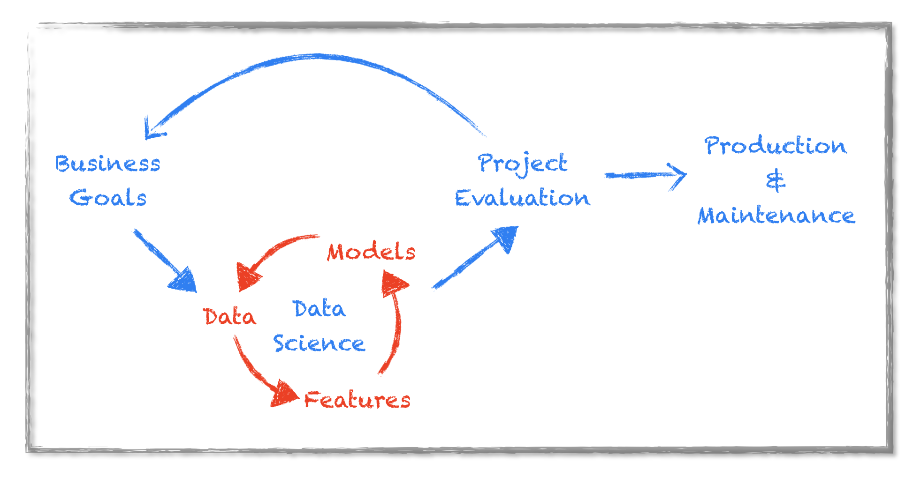
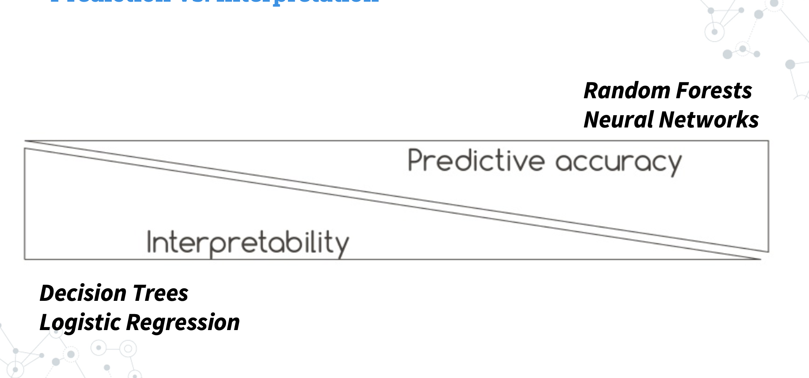
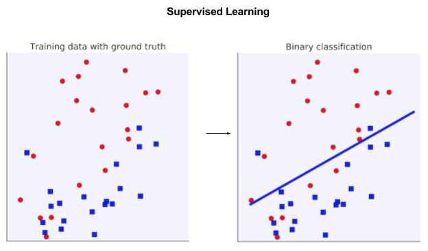
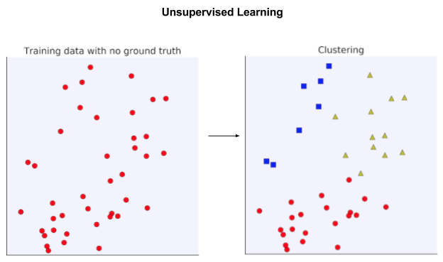
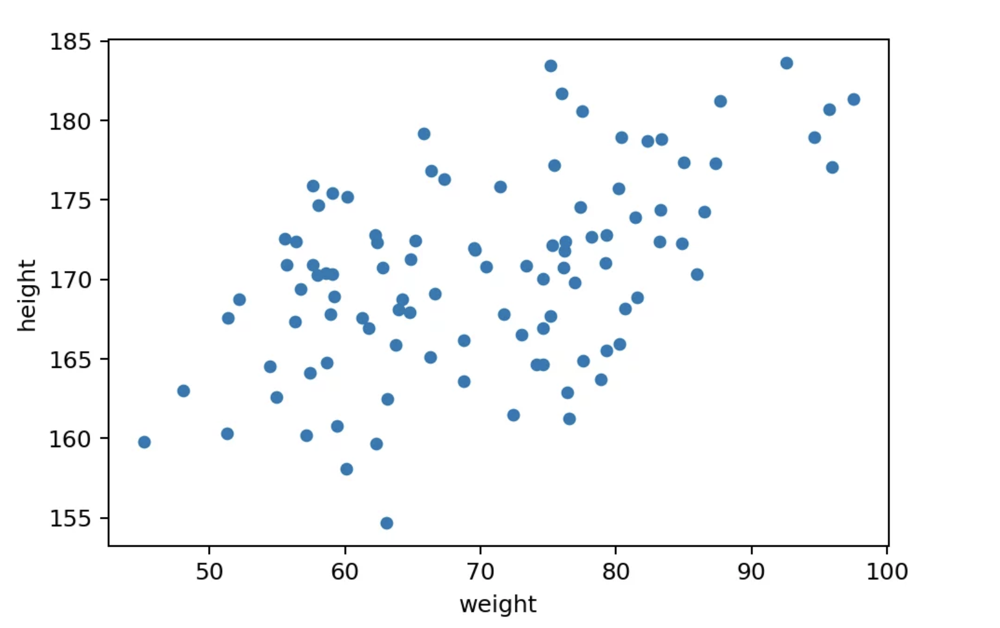
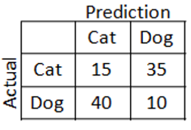
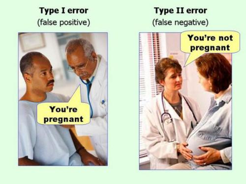

# S02

Introduction:
    title: Introduction to ML
content: |
    What is the concept of teaching a computer using data: what is machine learning
    Cycle of a data science project
    Vocabulary: model, inference, training,
    Applications of Machine Learning: nature of data, multimodality,
    Stats vs Machine Learning: explanation vs inference
    - illustrate with questions: find factors influencing vs predicting; understanding vs inference; ex users click on website
    - black box: interpretability, recruitment, credit
    Supervised vs non-supervised, ground truth data
    Regression, Classification, and Clustering
    Choosing the right Metric, scoring
    The importance of Benchmarking
    It's all about the data: [UCI ML](https://en.wikipedia.org/wiki/University_of_California,_Irvine#Machine_Learning_Repository) repo (1978), tabular data
    Kaggle competitions: titanic, boston housing
Demo: single tree with sklearn DecisionTreeClassifier on Iris, accuracy
Practice: same on penguins, accuracy, colab notebook, accuracy

## What is machine learning

Let's start by the beginning.

Good question

![Machine Learning by XKCD])(./../img/memes/xkcd_machine_learning_2x.png)
from https://xkcd.com/1838/

Let's ask an AI

**prompt**: concise definition of machine learning

**ChatGPT 4o**: **Machine Learning:** A branch of artificial intelligence (AI) where computers learn patterns from data and improve performance on tasks without being explicitly programmed.

**Gemini**: Machine learning is a field of computer science that enables computers to learn from data without being explicitly programmed.

*C*laude 3.5 Sonnet**: Machine learning is the field of computer science focused on developing algorithms and statistical models that enable computer systems to perform tasks through pattern recognition and inference, rather than explicit programming. The systems improve their performance with experience/data.

**[DeepSeek](https://chat.deepseek.com)** : Machine learning is a subset of artificial intelligence that involves training algorithms to recognize patterns and make predictions or decisions based on data, without being explicitly programmed for each task.

see also the definition from wikipedia: <https://en.wikipedia.org/wiki/Machine_learning>

    Machine learning (ML) is a field of study in artificial intelligence concerned with the development and study of statistical algorithms that can learn from data and generalize to unseen data, and thus perform tasks without explicit instructions.[1]

Let's decypher the DeepSeek definition and inspect it.

- Machine learning is a subset of artificial intelligence => subset of AI
- training algorithms to recognize patterns  => training a model on a dataset
- without being explicitly programmed => reducing a loss function
- make predictions or decisions => predictions on new data

My definition would be: **Training** a **model** on a **dataset** to use it for **predictions** on previously **unseen** data

- **dataset**: tabular data = csv, xlsx, spreadsheet but also images, sound, text, videos, ...
  - predictors, features
  - target variable
  - feature engineering
- **model**:
  - regression model: y = a x_1 + b x_2 + c
  - tree : [todo]: add tree
  - neural net
- **training**:
  - applying the fit method on the model
  - adapting the internal parameters of the model in an automated way in order to improve some internal scoring (loss function)
  - loss function: the criteria that drives the automatic modifications of internal parameters of the model
- **predictions**: aka inference
  - applying the trained model on new data.
- **unseen data**: robust, generalization,
  - If the model is well trained the predictions on new data are accurate. The model is able to generalize, it is robust

## Cycle of a data science project

It's all about the data

Several important elements here

### Data

- the data. It is key. see this from Andrew NG

How do you define data-centric AI, and why do you consider it a movement?

  Ng: Data-centric AI is the discipline of systematically engineering the data needed to successfully build an AI system. For an AI system, you have to implement some algorithm, say a neural network, in code and then train it on your data set. The dominant paradigm over the last decade was to download the data set while you focus on improving the code. Thanks to that paradigm, over the last decade deep learning networks have improved significantly, to the point where for a lot of applications the code—the neural network architecture—is basically a solved problem. So for many practical applications, it’s now more productive to hold the neural network architecture fixed, and instead find ways to improve the data.

from https://spectrum.ieee.org/andrew-ng-data-centric-ai

#### Small data vs Big data

It's relative. My very personal definition of big data is a dataset that can't be loaded in RAM. So a few Gb. But that's very conservative.

In this course we'll work on small data. Something that can be loaded in a google spreadsheet or Excel file.

The nature of the data also dictates the small vs big data consideration.

from small to big

- tabular: numbers, and text (categorical, paragraphs, ...)
- images: b&w, RGB, ..
- audio
- videos

from now on we consider tabular data.

### Data quality and relevance, signal vs noise

It's not because you have data that you can train a model for inference.

Data quality is essential.
- missing values
- outliers
- typos
- different data types
- access, ownership, privacy

### Feature engineering

- what variables are relevant ?

Is the hair color relevant to assess the value of a candidate ?

- how to chose the important ones ?

You have 200 samples but also 200 variables ? There's not enough data samples for the model to undertsand the data.
This is called the curse of dimension

- how to create new variables and why ?

You can transform existing variables into new variables with the goal of making the data easier to ingest by the model.

- log(1+x), x^2, abs(x), x*y, x+y, x/y, exp(x), ...

For instance: log(1+ x) is often used to make a distribution more normal, more gaussian (bell curve).

And Gaussianity is often an important aspect of data nroamlizatio making things easier to comprehend.

You can also import external data to complement your dataset.

For instance, road works data to complement traffic predictions in Paris.

### Business relevance and performance

You can always train some model to provide predictions and measure the performance of the model on some metric.

- accuracy, recall, precision, ...
- RMSE, MAE, ...
- silhouette score, ...

But does that metric reflect the proper value for the business?

For instance, what's the costs of False negatives vs False positives

- cyber security intrusion detection
- health, cancer detection
- call center, calling the people most likely to subscribe

## Stats vs Machine Learning: explanation vs inference

There are 2 main schools of thoughts, 2 disciplines when it comes to modelization: statistics and machine learning

Consider a dataset of users on a website. The dataset includes many variables
- behavior on the web site and on some other websites
- profiles and demographics
- ...

You are analyzing whether the use will buy or subscribe to something you have just launched. It's called conversion. A newsletter, a new product etc

Some questions can be

- what are the factors that influence conversion ? could it be the age of the person? the amount of time they have been registered users ? whether they already bought similar products ? etc etc
- here's a  user, what is the probability he or she will buy the new product

The 1st question is a statistical modeling question. The goal is to find the dynamics of variables that best explain the data.

The 2nd questions focuses on being able to make predictions on new samples. It's machine learning.
We don't care so much about the why. just that the predictions are efficient, accurate.

Leo Breiman two cultures paper: Statistical Science 2001, Vol. 16, No. 3, 199–231 Statistical Modeling: [The Two Cultures](./../breiman-two-cultures-1009213726.pdf)  :  Explain Nature or predict and don't care

There's a balance between predictability and interpretability

- Models that are good at prediction are (often) more complex
- Models that are easy to interpret are simple, and therefore, worse predictors

For instance: Decision Trees are super intuitive, but can’t model complex processes while Random Forests have excellent prediction accuracy, but are basically impossible to interpret

### Interpretability

Some context require machine learning predictions to be explainable.

For instance credit applications. The bank must be able to show why a certain application was rejected or approved

In HR, where discrimination is to be avoided, you cannot use bac box moddels

Model that cannot be explained are called black boxes.

- linear regression is not a back box model
- neural networks are black box models
- tree based models are in between

Some techniques exist to interpret black box models: [shap](https://christophm.github.io/interpretable-ml-book/shap.html), [lime](https://christophm.github.io/interpretable-ml-book/lime.html)

I strongly recommend that online book on [Interpretable Machine Learning](https://christophm.github.io/interpretable-ml-book/): A Guide for Making Black Box Models Explainable by [Christoph Molnar](https://bsky.app/profile/christophmolnar.bsky.social)

## Supervised vs non-supervised

Supervised learning and unsupervised learning are two primary types of machine learning, each with distinct characteristics and applications.

Supervised learning uses labelled data for tasks like classification, while unsupervised learning identifies patterns in unlabelled data.

Supervised: There's a subset of the data that is already labeled. For a classification task we know what categories each sample belongs to. We use that labelled data to train the model.

Supervised learning is used for classification and regression.

Unsupervised: We do not know the labels of the data, we want to find patterns in that data.

Unsupervised learning is used for clustering, dimension reduction and crystal ball divination

## Classification vs Regression

In supervised learning, there are 2 main tasks : classification and regression.

Regression concerns continuous target variables : predicting the price of a house for instance, or the temperature, ... any variable that has real values

Classification concerns predicting categories. yes vs no. true vs false, Male vs Female, up vs down etc

Classification can be further split into

- binary classification. only 2 categories are possible and mutually exclusive
- multi class classification. N >2 categories are possible and mutually exclusive. think of colors, types of cars, species of animals or trees, etc
- Multilabel Classification: N > 2 categories which are not mutually exclusive. For instance genre of films, documents, etc ...

## Clustering

Clustering is an Unsupervised learning tasks, where similar samples are grouped together. It is used to understand patterns in the data that are not explicit. For instance, clustering shoppers to understand behavior, or something similar.

## Dimension reduction with PCA

Imagine a dataset with 2 variables. easy to represent visually on a plot.
Something like a scatter plot will suffice.

if we have 3 dimensions, we can do a 3D scatterplot.

But after that, visualizing the data gets tricky.

So we need dimension reduction. An unsupervised task that uses PCA.

Input a dataset with N variables,
output a dataset with 2 variables
plot the 2 variables

Dimension reduction is also useful when you have a dataset with a lot of dimensions., a lot of variables, but not enough samples.

Then you reduce the dimensions of the dataset so that there's enough signal for the model to train on.

Dimension reduction with PCA is a standard pre processing step in machine learning.

## Choosing the right Metric

How do you evaluate the performance of a model ?

### classification

Simple case of binary classification, let's imagine a model that classifies photos of cats and dogs into their respective categories.

Or a model that predicts if you're going to get fired, already have cancer, be pregnant, win the lottery, commit a crime etc etc

What sort of metrics can you think of that would measure the performance of a classification model ?

first decide which class is the positive one and which class is the negative one.

Then think in terms of True positive, True Negatives, False positives and False negatives.

To illustrate the difference between False positives and False Negatives.

- Accuracy : TP + TN / population
- Recall:
- Precision

and many others

### regression

You want to estimate the distance between the predicted values and the real values.

Potential metrics include

- RMSE
- MAE
- MAPE

Note that the RMSE is relative to the range of the values of the target variable.

For house prizes the predicted values are in the Millions, while for temperatures they range roughly from -100 to +100.

## Benchmark

So you train your first model, choose an evaluation metric, and you get a score.

How do you know if that's a good score or a meh one?

Let's say you want to predict credit fraud.

your model predicts fraud with an accuracy of 55%. is that good ? bad ?

Would a simpler solution give the same performance ?

So in all your data science projects you first need to establish a benchmark, a basic performance with a simple model or a rule.

For instance, a benchmark for predicting the temperature tomorrow is ... that it will be the same as today. can't get ,much simpler than that. It so happens that this is hard to beat. It's a great benchmark.

In a binary classification task, can you do better than a coin flip ?

If you on';t establish a benchmark, you ddon;'t know if all the effort you put in your model and training an feature engineering is really worth it in the end.

## Data

One constant in all machine learning projects is that we need data.

data is everywhere but there are a couple of online resources to get good data

- The UCI machine learning repository <https://archive.ics.uci.edu/>
- Kaggle the machine learning competition platform <https://www.kaggle.com/>

The UCI ML repository was created in 1978! to host dataset for machine learning. It holds over 670 datasets for classification, regression, clustering, time series etc

A few classic datasets you should be familiar with are

- [Iris](https://archive.ics.uci.edu/dataset/53/iris) created in 1936
- [Titanic](https://www.kaggle.com/competitions/titanic/data)
- [Boston housing](https://www.kaggle.com/datasets/schirmerchad/bostonhoustingmlnd)

and many other fun datasets and competitions.

## Demo

Let's look at the

