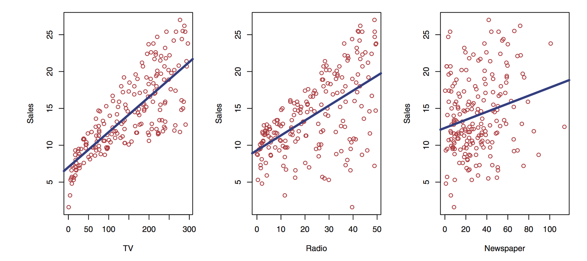
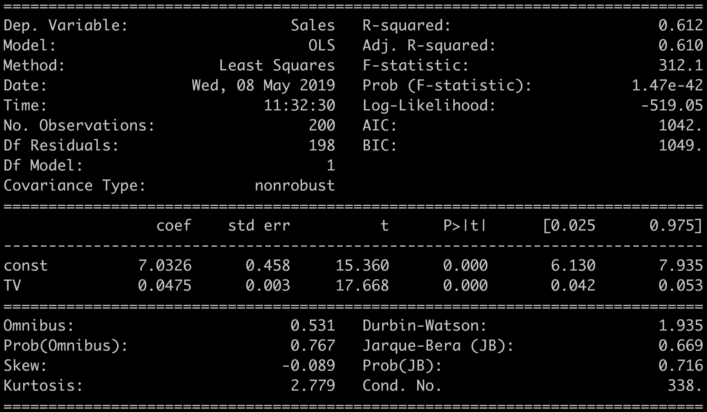
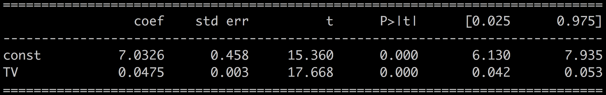
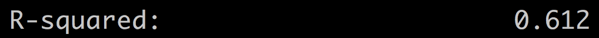
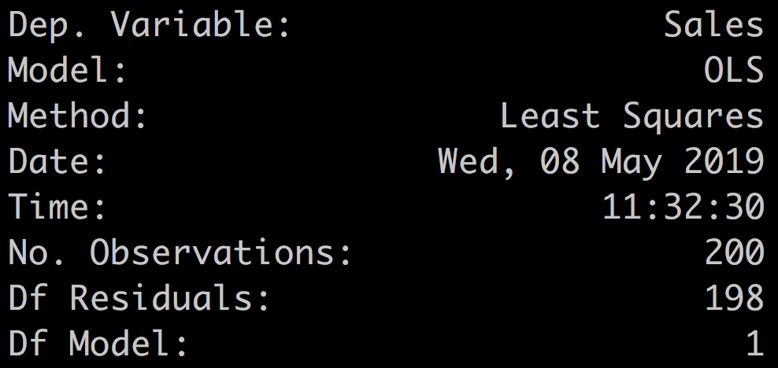
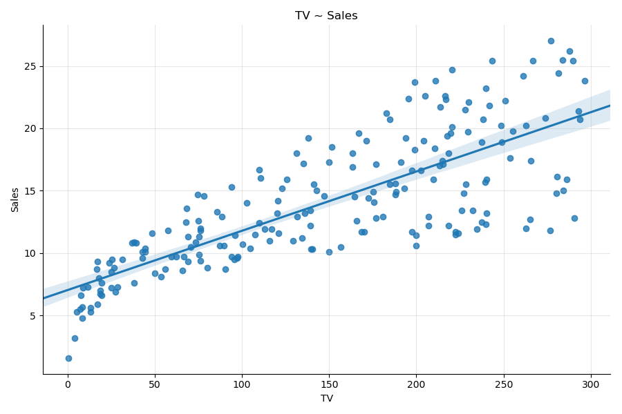
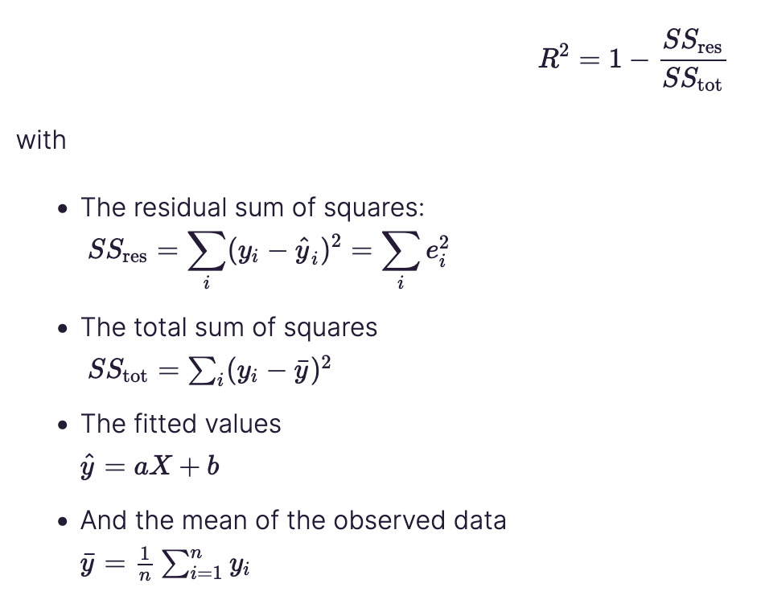

# Linear regression with stats model - univariate


## Warm up


### Correlation


- what is correlation ?
    - <https://pandas.pydata.org/pandas-docs/stable/reference/api/pandas.DataFrame.corr.html>
- what are the different types of correlation ?
  - [pearson](https://en.wikipedia.org/wiki/Pearson_correlation_coefficient)
  - [spearman](https://en.wikipedia.org/wiki/Spearman%27s_rank_correlation_coefficient)
  - [kendall](https://en.wikipedia.org/wiki/Kendall_rank_correlation_coefficient)
- can you calculate correlation between discrete variables ?
  - yes if both variable are ordinal

see
- https://openclassrooms.com/fr/courses/5873596-perform-effective-data-modeling/6199591-calculate-correlation
- https://github.com/OpenClassrooms-Student-Center/Design-Statistical-Models/blob/master/P1CH3_02%20Anscombes%20Quartet%20DatasaurusDozen.ipynb
-


### Other important concepts [teaser]

- how to define linearity between variables ?
- what is hypothesis testing ?
- how to test if a variable has a gaussian distribution ?


# Build and Interpret a Univariate Linear Regression Model

- see <https://openclassrooms.com/fr/courses/5873596-perform-effective-data-modeling/6229141-implement-univariate-linear-regression>


Three main concepts underlying linear regression models:

- correlation,
- linearity,
- hypothesis testing.

Let's build linear models with linear regression

We  work with the `advertising` dataset, and using the  `statsmodel` Python library.

The advertising dataset contains 200 samples with amounts spent on three different media channels: newspaper, radio, and TV. The sales variable is the outcome, aka the target variable.

Our goal is to understand how spending amounts on each one of these channels influence sales. We start with univariate regression, building linear models between the target variable sales and one input variable at a time. This will allow us to analyze the results in detail, and learn which media is the most efficient to increase sales.


By the end of this chapter, you will be able to:

- Build a regression model
- Interpret the results of the regression using R-squared, p-values of the coefficients, and the t-statistic.


## The Dataset

This `advertising` dataset is a classic one in statistical learning. It is analyzed in an excellent book called Introduction to Statistical Learning by James, Witten, Hastie, and Tibshirani, available [online for free](http://www-bcf.usc.edu/~gareth/ISL/ISLR%20Sixth%20Printing.pdf).

The dataset consists of 200 samples with four variables:

- Advertising budgets for newspaper, TV, and radio (the predictors)
- Sales (the outcome)

```text
TV  Radio  Newspaper  Sales
0  230.1   37.8       69.2   22.1
1   44.5   39.3       45.1   10.4
2   17.2   45.9       69.3    9.3
3  151.5   41.3       58.5   18.5
4  180.8   10.8       58.4   12.9
```

Our goal here is to be able to adjust advertising budgets to increase sales. In other words, we want to build a model that can tell us how much increase in sales is associated with a given increase in TV, radio, or newspaper advertising.

## Visualization

Start by plotting each input variable to the outcome variable.



You can already infer some information from these plots:

- As TV and radio spending increase, so do sales.
- Newspaper spending impact on sales is less pronounced, although there is a trend.
- It looks like TV spending is more efficient than radio as the overall trend of the plot looks steeper.

Calculating the correlation between the variables gives:

```python
df = pd.read_csv('advertising.csv')

df.corr()['Sales']
```

```bash
TV 0.782224
Radio 0.576223
Newspaper 0.228299
Sales 1.000000
```

Which confirms what we inferred from the plots above since TV is the variable with a higher correlation coefficient.

> TV correlates most with sales, followed by radio, and then newspaper.

## Univariate Linear regression

Univariate linear regression is when you want to predict the values of one variable from the values of another.

Let's start by building a linear model between `sales` and `TV`, which is the variable most correlated with the outcome.

We want to find the best coefficients `a` and `b` such that:

```text
Sales= a * TV + b
```

For that, we turn to the [`statsmodel`](https://www.statsmodels.org/stable/index.html) library in Python, which can be installed with:

```bash
# in the terminal
pip install statsmodels

# in a jupyter notebook (note the extra !)
!pip install statsmodels
```

`statsmodel` is a Python module that provides classes and functions for the estimation of many different statistical models, as well as for conducting statistical tests and statistical data exploration.

We use OLS: [ordinary least square](https://www.statsmodels.org/stable/examples/notebooks/generated/ols.html)

## Ordinary Least Square

see <https://en.wikipedia.org/wiki/Ordinary_least_squares>

### What is exog and endog?

If you look at the [statsmodel documentation on `OLS`](http://www.statsmodels.org/devel/generated/statsmodels.regression.linear_model.OLS.html), you will notice that the input variable is called `exog`, while the outcome variable is called `endog`. These are shorthand for:

- Endogenous: caused by factors within the system.
- Exogenous: caused by factors outside the system.

How this relates to the concept of predictors and target variables is fully explained [here](https://www.statsmodels.org/stable/endog_exog.html#endog-exog).  In our case, we  continue to use terms like input, dependent, or predictor variable for X, and output, outcome, target, or independent variable for y.

## Sales ~ TV

To build a linear model between sales and TV, use the method called ordinary least square, or OLS. In short, the OLS method will find the line closest to all the points of the plot as shown:


The following is the code to build and fit the linear regression model to the data:

- import the modules

```python
import statsmodels.formula.api as smf
import pandas as pd
```

- Load the dataset

```python
df = pd.read_csv('advertising.csv')
```

- define the regression

We use the formula version of the library.
This allows to write the regression simply with

```text
formula='Sales ~ TV'
```

or more generally

```text
formula='target ~ x_0 + x_1 + .... + x_{N-1}'
```

- Define the model

```python
model = smf.ols(formula='Sales ~ TV', data=df)
```

- Fit the model to the data

```python
results = model.fit()
```

and print the results

```python
results.summary()
```

Which gives the following output:



---

<div style="width: 80%; margin: 20px auto; border: 2px solid red;  padding: 10px; text-align: left; font-size : 1.4em">
<strong>Your turn</strong>:
build a  linear regression model with

- Sales ~ Radio
- Sales ~ Newspaper
</div>

---


## Interpreting the Results

Let's break this down. For a start, we  only focus on a few of the metrics.

The most important element of the results is the line with the values for the coefficients, p-value, and confidence intervals:



The metric R-squared:


The `results` object has many functions, and can be used to display:
- A summary of the regression with  `results.summary,`
- the coefficients with  `results.params`,
- the p-values with  `results.pvalues`,
- and the different metrics for instance R-squared with  `results.rsquared`, AIC with `results.aic`, etc.

The upper-left quadrant of the results are mostly a summary of the method indicating the name of the outcome variable (here,  Dep. Variable ), which is  sales; the  model,  OLS; the  method,  least squares; and the  number of samples (here,  No. Observations),  200.





## Regression Versus Correlation

Both regression and the correlation coefficients are a measure of the influence of the predictor on the outcome. However, they differ in the way they represent that influence.

In the univariate case, regression and correlation coefficients share the following properties:

- The regression coefficient is equal to Pearson's correlation coefficient.
- The square of Pearson's correlation coefficient is the same as the R-squared.

However, regression and correlation coefficients are different measures of the data. Here are a few differences:

- Correlation is symmetrical, while linear regression is not. Swapping the outcome with one of the predictor in multivariate regression will not give you the same coefficients.
- Linear regression can be used to make predictions, correlation coefficient cannot.
- Correlation works for nonlinear relations between variables, while linear regression works on linear relationships.

So correlation and regression are complementary, but intrinsically different ways of measuring the coupling between variables.

## Fitted values

We can plot the line estimated by the OLS method with the  `results.fittedvalues`  method. As its name indicates, the fitted values can be obtained from the regression coefficients:

```python
results.fittedvalues = results.params['TV'] * df['TV'] + results.params['const']
```

You can also access the residuals, i.e., the error between the real values and the fitted values.

```python
results.resid = df['Sales'] - results.fittedvalues
```

For ease of manipulation, let's add the fitted values to the initial DataFrame.


```python
df['fitted'] = results.fittedvalues
```

To plot the fitted values versus the real values,  sort the DataFrame. This is just for plotting convenience.

```python
df.sort_values(by = 'TV', ascending = True, inplace = True)
```

Then plot the fitted values and the residuals with:

```python
plt.scatter(df.TV, df.Sales, label = 'Sales' )

plt.plot(df.TV, df.fitted, label = 'Fitted' )

plt.legend()
```


<div style="width: 80%; margin: 20px auto; border: 2px solid red;  padding: 10px; text-align: left; font-size : 1.4em">
<strong>Your turn</strong>:

- plot the TV vs Radio and TV ~ fitted values for TV ~ Radio
- plot the TV vs Newspaper and TV ~ fitted values for TV ~ Newspaper
</div>

In terms of plotting and making a regression at the same time, Seaborn offers the `regplot` method.  `sns.regplot(x=df.TV, y=df.Sales)`  generates this plot right out of the box.




## Coefficients

Let's focus on the coefficients and related statistics:


In our case, we have:

df.Sales= 0.0475 * df.TV + 7.0326

This also tells us that if we were to spend nothing on `TV`, then the sales would still be predicted to equal 7.0326.

<div style="width: 80%; margin: 20px auto; border: 2px solid red;  padding: 10px; text-align: left; font-size : 1.4em">
<strong>Your turn</strong>:
What are the univariate coefficients for the  `TV ~ Radio` or  `TV ~ Newspaper`
</div>


## P-values

Next, the  `P>|t|`  value is the p-value associated with the coefficient.

The p-value for each coefficient tests the null hypothesis that the coefficient is equal to zero (no effect).

The p-values can be obtained with:

```python
print(results.pvalues)
```

```bash
const 1.406300e-35
TV 1.467390e-42
```

You can see here that the p-values are well below the standard threshold of 0.05. You can, therefore, reject the null hypothesis and conclude that the coefficient values are **relevant** given the data.

## T-Statistic and Standard Error

The standard error is an estimate of the variations of the coefficient.
The t-statistic is the coefficient divided by its standard error.

$$
t = \frac{coeff}{StdErr}
$$

The t-statistic is a measure of the precision with which the regression coefficient is measured.

A coefficient with a comparatively small standard error, is more reliable than one with a comparatively large standard error.

In our case, looking at the coefficient for TV (a = 0.0475), we have a standard error of 0.003, which is much lower than the coefficient, and a t-value of 17.67, which is much higher than the coefficient.

We can conclude that the coefficient estimations are centered around its given value.


## Confidence Intervals

The 97.5% confidence interval (CI) is the likely range of the true coefficient.

The confidence interval reflects the amount of random error in the sample and provides a range of values that are likely to include the unknown parameter.

**Important**: If the confidence interval contains the value **zero**, it means that there's a 95% chance that the true coefficient equals zero. But, a zero coefficient corresponds to the null hypothesis we were looking to reject in the first place. So if the confidence interval contains zero, we can no longer reject the null hypothesis and cannot trust the coefficient value given by the regression. In practice, when the confidence interval contains zero, then the p-value is usually large, so we cannot reject the null hypothesis anyway.


## R-Squared

R-squared, also known as the **coefficient of determination**, measures the **predictive quality** of your model.

R-squared is defined as : the amount of variation of the target variable which is explained by your model.

R-squared is always positive and lower than 1.

> The rule of thumb is to have R-squared values around or superior to 0.75, but that depends on your data and your domain of application. In our case, we have an R-squared of 0.612, which indicates that our simple model only accounts for 61% of the variability in sales. This can be improved.

R-squared is helpful when comparing different models.  In the following demo, we'll build models based on the other two media; radio and newspaper and compare the coefficients and R-squared values for all the media.


R-squared is calculated as the ratio of the variance of the target variable with the variance of the residuals:




<div style="width: 80%; margin: 20px auto; border: 2px solid red;  padding: 10px; text-align: left; font-size : 1.4em">
<strong>Your turn</strong>:
For the 2 other models what are

- R-squared
- Confidence Intervals
- T-Statistic and Standard Error

What can you conclude?
</div>

## Summary

Looking at the results of a linear regression, these are the main things you need to look at to assess the quality of your model:

- The coefficients are an indication of the correlation of your input variable(s) with the outcome.

- The associated p-values and confidence intervals tell you how much trust you can put in these coefficient estimations. The p-value also tells you how confident you can be that each individual variable has some correlation with the outcome.

- When the p-value > 0.05, or when the confidence interval contains 0, then the coefficients are not reliable.

- The t and standard error also give an indication of how much the coefficient varies around the estimated value. You want a high t and a low standard error compared to the value of the coefficient.

- The R-squared shows you how much of the variations in the target variable are explained by the model. The higher the better. The R-squared is particularly relevant when using the model to make predictions.


