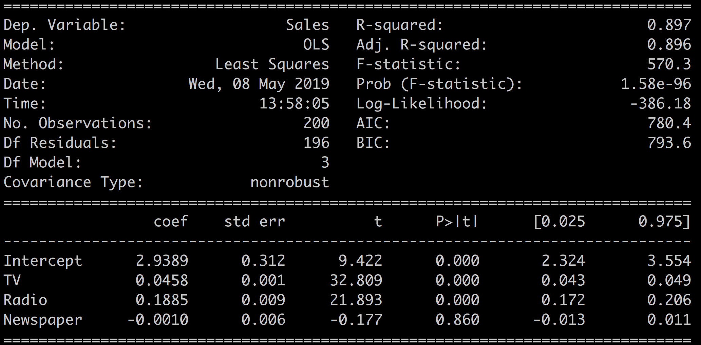
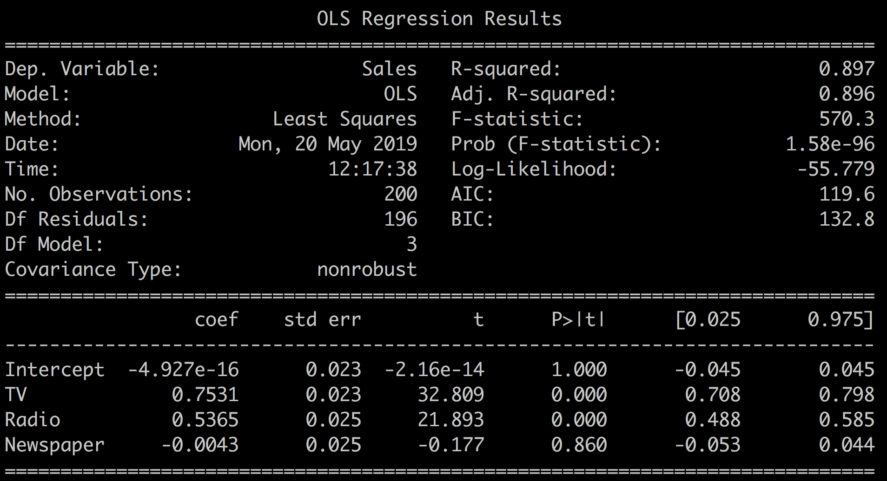
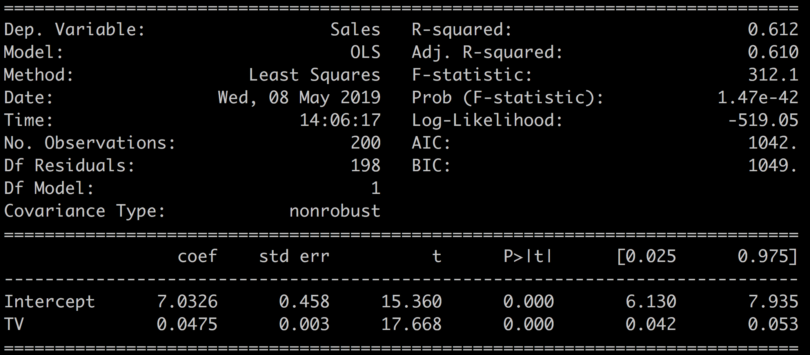

# Build and Interpret a Multivariate Linear Regression Model


https://openclassrooms.com/fr/courses/5873596-perform-effective-data-modeling/6229526-apply-multivariate-linear-regression


You now know how to implement and interpret univariate linear regression, relations between one variable, and an outcome variable.

Let's expand the univariate linear regression method to multivariate linear regression, where multiple variables are used to predict the outcome variable. We continue to work with the advertising dataset.

We define a more complex model that takes into account all three budgets: TV, radio, and newspaper, using the linear regression results from that model to illustrate a new set of metrics.

You will learn:

- The generalized statsmodel API, a more general and easier way to define a linear regression model.
- How to interpret other metrics present in the summary of the linear regression: AIC, BIC, adjusted R-squared, and the F-statistic and F-proba.

- How to compare several linear regression models and select the best one

We will also analyze the impact of normalization and look at the difference between correlation coefficients and linear regression coefficients.

## The Generalized API

To define a regression model through a formula,  `import formula.api`  and call the OLS method as such:

```python
import statsmodels.formula.api as smf

model = smf.ols(formula='Sales ~ TV + Radio + Newspaper', data=df)
```

This formula  defines a model with TV, radio, and newspaper as predictors, and sales as a target variable.

$$Sales \sim TV + Radio + Newspaper$$

Using the formula above to define the model, `Sales ~ TV + Radio + Newspaper`  is similar to this code:

The formula model definition can be used to define more complex models very simply.

For instance:

- `Sales ~ Radio + TV * Newspaper` adds a new predictor  `TV *  Newspaper`  to the model.

- `Sales ~ TV + np.log(TV)`  adds the log of TV as a predictor. (np stands for numpy: `import numpy as np`)


## A New Model

Let's directly build a new model based on all three predictors

$$
    Sales \sim TV + Radio + Newspaper
$$

It goes like this:

```python
import statsmodels.formula.api as smf

model = smf.ols(formula='Sales ~ TV + Radio + Newspaper', data=df)

results = model.fit()

print(results.summary())
```


Which results in:



A couple of things stand out:

- **R-squared = 0.897**. Compare that with the R-squared = 0.612 that we had for the model Sales ~ TV in the previous chapter. Adding the two other variables increased R-squared significantly. This explains close to 90% of the sales variable with the new model!

- **Newspaper = -0.001**. The Newspaper variable has a negative coefficient!
This would indicate that the more you spend on newspaper ads, the less you sell. This really does not make sense.

What saves the day is that the newspaper p-value (0.86) is well above the 0.05 threshold, and the confidence interval ([-0.013, 0.011]) contains zero.

**Therefore**, you (cannot reject the null hypothesis that this variable has no effect on the outcome and) conclude that you cannot trust this negative newspaper coefficient value.  pfff!

## Regression Coefficients With Multiple Predictors

In the context of multivariate linear regression, a coefficient tells you how much the input variable is expected to increase when that input variable increases by one, holding all the other input variables constant. For instance, if you increase the radio budget by $1,000, the coefficient 0.1885 tells you that, all other variables being constant, sales will increase by $188.5.

---

<div style="width: 80%; margin: 20px auto; border: 2px solid red;  padding: 10px; text-align: left; font-size : 1.4em">
<strong>Your turn</strong>:

Let's practice on the school dataset. We want to predict the weight given the height, sex, and age of the kids
- load the school dataset
- transform the sex variable into a numerical value 0/1
- build a linear regression model to predict the weight given the height, sex, and age of the kids
- what can you conclude ?

- compare the value of the coefficients between the different regressors. What can you conclude ?

</div>

---


## Standardizing Your Data

What's the impact of standardizing the data, and should you do it? That question often comes up in online forums. In short, this has no impact on the quality of the model, but it can help to interpret the coefficients.

The value of the regression coefficients depends on the average of the input variable. The higher the average of the variable, the lower its coefficient. The mean of the TV and radio budget variables is:

```python
print(df[['TV','Radio']].mean())
TV 147.0425
Radio 23.2640
```

TV advertising is roughly six times as important as radio. The magnitude of coefficients of the linear regression reflect that disparity. The radio coefficient is roughly five times bigger than the TV coefficient

```python
print(results.params)

- Intercept 2.938889
- TV 0.045765
- Radio 0.188530
- Newspaper -0.001037
```

Should we standardize the input variables to compensate for large differences in scale?

There are multiple ways to standardize or normalize a variable. By standardizing, we mean centering the variable and dividing by the standard deviation which transforms the variable into a mean 0, standard deviation 1 variable.

$$
\hat{x}= \frac{x − E(x)} {\sigma(x)}
$$

We could also have normalized the variable by dividing it by its maximum value.

$$
\hat{x}=\frac{x}{max(x)}
$$

Standardizing the variables will change the value of the regression coefficients, but will not influence the conclusions of the regression.

However, regression coefficients for standardized data cannot be interpreted as a relative measure of importance on the outcome variable. The deviation and mean of an input variable are not the only factors in determining the influence of a variable on the outcome.

To illustrate that point, let's standardize our data:

```python
df_standardized = (df - df.mean()) / df.std()
```

Run a regression:

```python
model_standardized = smf.ols(formula='Sales ~ TV + Radio + Newspaper', data=df_standardized)
results_standardized = model_standardized.fit()
```

Look at the results:

```python
print(results_standardized.summary())
```

Which gives:




R-squared, F-statistics, t-test, and p-values have not been modified by the standardization of the variables. The values of the regression coefficients have changed and are easier to read, but less interpretable.

> In conclusion, for linear regression, there's no need to standardize your data except to make coefficients easier to read.


## Interpret the Results

In the last chapter on univariate regression, we worked on some of the metrics available in the  `results.summary()`.

In particular, we focused on:

- R-squared: a measure of the predictive power of the model.
- The predictor coefficient and associated p-value.
- The t-test,standard error, and the confidence interval.

Let's now look at some of the other metrics available in the results summary.

We have two new metrics to assess the quality of the model:

- **Adj. R-squared**: a version of R-squared that takes the complexity of the model into account.
- The **F-statistic** that tells you if your model is any better than a nothing model.

And three new metrics for model comparison:

- The **log-likelihood**: a measure of the probability of each sample given the model.
- **AIC** and its cousin **BIC** based on the number of samples and the log-likelihood.

We use the model from the previous chapter to illustrate these multivariate model-comparison metrics:

`M1: Sales ~ TV` versus `M2: Sales versus TV + Radio + Newspaper`.

The Sales ~ TV results are recalled here:


## Adj. R-Squared

There's a well-known catch with linear regression.

Adding more and more input variables to your model almost always increases the R-squared value at the expense of complexity.

As each new variable adds information to the model, its predictive power increases little by little with each extra predictor. R-squared increases a bit every time you add a predictor. However, after a certain point adding variables will only model the noise in the dataset instead of the true relationships between the predictors and the outcome.

For instance, you could build a model adding multiple variations of the original input variables
- log(TV
- Radio^2
- 1/Newspaper

 Or you could add many new variables from external datasets

To balance this increase in R-squared and complexity of the model, you can look at the `adj. R-squared`.

The adjusted R-squared is a modified version of R-squared that **penalizes large numbers of predictors** in the model. Adjusted R-squared only increases if adding a new variable improves the model more than would be expected by chance.

For instance, comparing two models with the same R-squared: one simple model with one predictor and the other more complex with many predictors; the more complex model would have a lower adjusted R-squared than the simple one. It's always best to look at the adjusted R-squared to evaluate the predictive power of a regression model.

For most models, R-squared and adj. R-squared have very similar values.

In our case, adding the two other variables: radio and newspaper to the model, has improved the quality of our model since both R-squared and the adjusted R-squared have increased.


| Model                          | R-squared | Adj. R-squared |
| ------------------------------ | --------- | -------------- |
| Sales ~ TV                     | 0.612     | 0.610          |
| Sales ~ TV + Radio + Newspaper | 0.897     | 0.896          |


---

<div style="width: 80%; margin: 20px auto; border: 2px solid red;  padding: 10px; text-align: left; font-size : 1.4em">
<strong>Your turn</strong>:

- Compare 2 different models on the scholl dataset. How does the R-squared and Adj R-squared vary ?
</div>

---


## F-statistic and F-proba

The F-statistic tests the overall significance of the regression model by comparing the full model against a model where all of the regression coefficients are equal to zero, keeping only the intercept. It tells you if your model is better than nothing.

The associated null hypothesis is defined as:

> H0 : The coefficients of the predictors are all equal to 0.

Which means that the predictors do not add any information to the outcome when compared to a model that just takes the intercept into account.

- The associated F-proba is the p-value for this null hypothesis.
- The F-statistic can take any value superior to 1.
- F = 1 means that the model is not better than a constant value.

In our case, we have for our two models:

| Model                          | F-statistic | Prob (F-statistic) |
| ------------------------------ | ----------- | ------------------ |
| Sales ~ TV                     | 312.1       | 1.47e-42           |
| Sales ~ TV + Radio + Newspaper | 570.3       | 1.58e-96           |

Which shows that:

- Both models are statistically significant and better than a simple constant model.
- The multivariate model explains more of the outcome variable variance than the univariate model.

## How is F-statistic different from R-squared?
R-squared provides a measure of the strength of the relationship between predictors and the outcome variable, and it does not comment on whether the relationship is statistically significant. F-statistic gives you the power to judge whether that relationship is statistically significant. In other words, it comments on whether or not R-squared is significant.

<div style="width: 80%; margin: 20px auto; border: 2px solid red;  padding: 10px; text-align: left; font-size : 1.4em">
<strong>Your turn</strong>:

- Compare 2 different models on the school dataset. How does the F-statistic vary ?
</div>


## Log-likelihood

The log-likelihood is a measure of the probability of seeing the data you have if that data was generated by your model.

How is the log-likelihood calculated?

For each sample, consider the probability of obtaining that sample given the model:  p(sample/model)

. Now take the log of that probability and sum all the log of probabilities for all the samples. This is the definition of the log-likelihood:

$$
\text{log-likelihood} = \sum_{\text{all_samples}} \log(  p(sample/model)  )
$$


In short:

- The log-likelihood is always a negative number because you are taking the log of probabilities whose values are by definition within [0,1].
- A better model leads to higher probabilities of observing the samples in your dataset and higher values of the log-likelihood.
- The higher the log-likelihood is, the better.

In our case:

| Model                          | Log-likelihood |
| ------------------------------ | -------------- |
| Sales ~ TV                     | -519.05        |
| Sales ~ TV + Radio + Newspaper | -386.18        |

Which shows that the multivariate model is better than the univariate one since -386.18 > -519.05.

Log-likelihood is an important concept which directly drives the calculation of the coefficients.

<div style="width: 80%; margin: 20px auto; border: 2px solid red;  padding: 10px; text-align: left; font-size : 1.4em">
<strong>Your turn</strong>:

- Compare 2 different models on the school dataset. How does the Log-likelihood vary ?
</div>


## AIC and BIC

Next, we look at AIC and BIC, which stand for Akaike information criterion (AIC), and Bayesian information criterion (BIC). Both metrics are used to compare models. There is no "good" value for them as they are both relative statistics.

AIC is defined as

$$
AIC = \text{the number of predictors of the model} − \text{log-likelihood}
$$

AIC balances the complexity of the model (number of parameters) with its performance (log-likelihood). The number of parameters acts as a penalty term on the performance of the model (the log-likelihood). This is similar to the adjusted R-squared statistic, which also balances complexity with performance.

In other words:

- AIC estimates the relative amount of information present in the dataset which is lost by a model.
- The less information a model loses, the higher the quality of that model.
- The preferred model is the one with the minimum AIC value.

BIC is very similar to AIC. In BIC, the penalty term for the model complexity is more important, and also takes the number of samples into account.

BIC is defined as:

$$
BIC=k \log(n)−\text{log-likelihood}
$$

where n is the number of samples, and k the number of predictors.

Similar to AIC, the model with the lowest BIC is preferred.

## Why have both BIC and AIC?

The short answer is that these two criteria behave differently, and their comparative results can be interpreted differently. AIC focuses on detecting underperforming models, while BIC focuses on detecting overly-complex ones. In practice, both will often lead to the same conclusion as to which model is better. For more details on the subject, read this discussion.

In our case, we have:

| Model                          | AIC   | BIC   |
| ------------------------------ | ----- | ----- |
| Sales ~ TV                     | 1042  | 1049  |
| Sales ~ TV + Radio + Newspaper | 780.4 | 793.6 |

This reflects that the multivariate model is better at modeling the data than the univariate model since it leads to lower AIC and BIC.

## Cheat Sheet - Recap of the Metrics

You've seen quite a few ways to assess and compare the reliability and performance of your models. The following tables recapitulate what to look for when comparing models built on the same dataset.

### Asses the Relevance of Your Model

To understand the quality of your model, look at these indicators:

| metrics             | definition                                                                            | interpretation                                                                              |
| ------------------- | ------------------------------------------------------------------------------------- | ------------------------------------------------------------------------------------------- |
| Coefficients        | Influence of the predictor on the outcome when all other predictors are kept constant |                                                                                             |
| P(t)                | P-value of the coefficient                                                            | Smaller = better ; When p(t)  > 0.05 the coefficient is unreliable                          |
| Confidence interval | The 2.5% - 97.5% interval for the coefficient                                         | Smaller = better;    If the confidence interval contains 0, the coefficient is not reliable |
| Std Err.            | The standard error is an estimate of the variations of the coefficient                | Smaller = better;                                                                           |
| t-statistic         | The coefficient divided by its standard error                                         | Smaller = better                                                                            |

### Compare Models

For model selection, look at these indicators:

| metric         | def                                                                                                  | interpretation                                                                              |
| -------------- | ---------------------------------------------------------------------------------------------------- | ------------------------------------------------------------------------------------------- |
| R-squared      | Amount of variation of the outcome explained by your model                                           | Bigger = better                                                                             |
| Adj. R-squared | R-squared adjusted for model complexity                                                              | Bigger = better                                                                             |
| Log-likelihood | A measure of the probability of observing the data samples if the dataset was generated by the model | Always negative;    Bigger = better                                                         |
| F-statistic    | Measures performance of the model compared to a constant only model                                  | Bigger = better;     Always > 1;    if F = 1, the model is not better than a constant value |
| F-proba        | P-value associated to the F-statistic                                                                | if F-proba > 0.05, the model is not better than a constant based model                      |
| AIC & BIC      | Measure the performance of the model balancing the complexity and the log-likelihood                 | Lower = Better;  Relative values                                                            |

This wraps up our second tour of the different metrics of the results summary. We haven't looked at the bottom part of the summary that includes metrics like Omnibus, Skew, Durbin-Watson, and others. These are mostly used to assess the quality of the dataset and are explained in the next chapter.

## Your turn

---

<div style="width: 80%; margin: 20px auto; border: 2px solid red;  padding: 10px; text-align: left; font-size : 1.4em">
<strong>Your turn</strong>:

Find the difference between several models:

- The full multivariate model Sales ~ TV + Radio + Newspaper.
- The multivariate model without the Newspaper variable Sales ~ TV + Radio.
- And alternate model that multiplies TV and Newspaper Sales ~ TV + Radio + TV*Newspaper.

Look at how these different models perform, and select the best one using the metrics of this chapter.
</div>

---


## Summary

In this second chapter on linear regression, we worked on a multivariate model, and addressed the following items:

- Using formulas to define regression models.
- Definitions and interpretation of new metrics: Adjusted R-squared, F-statistic and F-proba, AIC and BIC.
- The impact of standardization of the variable on the regression results.
- The link between regression and correlation coefficients.

So far, we've applied linear regression to a few datasets without asking too many questions about the operation validity and the nature of the data. However, linear regression is not a generic method that can be blindly applied to any type of dataset. Some conditions need to be met!


