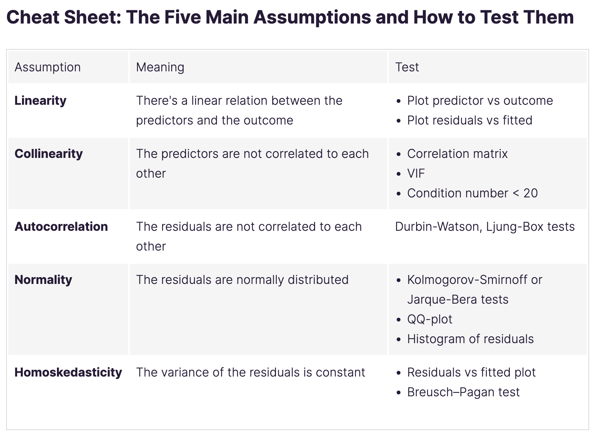

# Conditions of linear regression

see <https://openclassrooms.com/fr/courses/5873596-perform-effective-data-modeling/6232921-check-assumptions-of-regression>

For linear regression to work, the data must verify five assumptions:

## Two conditions on the predictors and outcome:

    - Linearity: the data has to be somewhat linear.
    - Collinearity: the predictors are not correlated.

> the condition number (Cond. No.) displayed in the lower half of the results summary is also a direct measure of multicollinearity. Smaller values (<20) indicate less multicollinearity.

## three conditions on the residuals of the regression:

- **Autocorrelation**: the residuals are not correlated to one another.

The Durbin-Watson statistic is a direct test of the correlation of the residuals. It takes a value from 0 to 4, where:

  - 2 means no autocorrelation.
  - 0 to 2 means positive autocorrelation.
  - 2 to 4 means negative autocorrelation.

As a rule of thumb, values in the range of 1.5 to 2.5 are relatively normal.

- **Normality**: the residuals must be normally distributed.

Several ways to assess that property of the residuals:

  - Using a Kolmogorov-Smirnov test for goodness of fit.
  - Drawing the QQ plot.
  - Plot the histogram of the residuals and compare it with the histogram of a normal distribution.

The **Jarque-Bera** statistic measures two key characteristics of normal distribution: skewness and kurtosis, which are also indicated in the lower part of the results summary.

- Homoscedasticity: the variance of the residuals is stable (the inverse is called heteroscedasticity!)

The **heteroskedasticity** assumption means that the variance of the residuals has to be constant for the regression to be reliable. You can detect it by plotting the residuals versus the fitted values. The variance of the residuals should not increase or decrease as the fitted values increases.

---

<strong>Your turn</strong>:

Test a few models on the school dataset.

Pay attention to the assumptions. Specially the ones you can verify from the `result.summary()`

---

